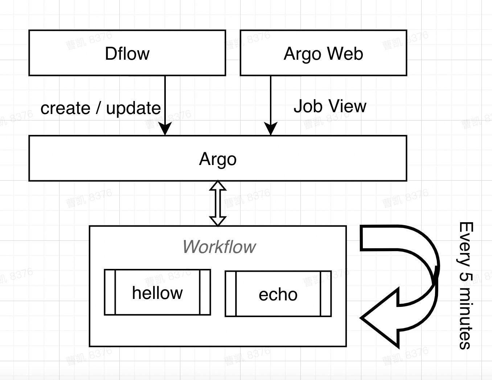

# dflow: run crontab job

## Introduction
At present, most of them use Linux scheduling tasks to deploy timed scripts. When a lot of scripts are broken, they often forget to deploy and update; If there is a dependency between timing scripts, it is also very troublesome to handle; When the script is time-consuming, it is not easy to automatically start parallel acceleration. Using dflow's planning workflow mode will be better.

## Details



### Codes 

```python
from dflow import (
    ShellOPTemplate,
    InputArtifact,
    OutputArtifact,
    CronWorkflow,
    Step,
)

if __name__ == "__main__":
    hello = ShellOPTemplate(name='Hello',
                            image="alpine:latest",
                            script="sleep 60 && echo Hello > /tmp/bar.txt")
    hello.outputs.artifacts = {"bar": OutputArtifact(path="/tmp/bar.txt")}

    echo = ShellOPTemplate(name='Echo',
                           image="alpine:latest",
                           script="while [ 1 ]; do echo 'waiting...';"
                           " if [ -f /tmp/foo.txt ]; then cat /tmp/foo.txt;"
                           " break; fi; sleep 1; done")
    echo.inputs.artifacts = {"foo": InputArtifact(path="/tmp/foo.txt")}

    # This workflow will run every 5 min
    cwf = CronWorkflow(name="test-cron", schedule='*/5 * * * *')
    step0 = Step(name="hello", template=hello)
    # This step will give output artifact "bar" which contains "Hello" after
    # 60 seconds
    step1 = Step(name="echo", template=echo, artifacts={
                 "foo": step0.outputs.artifacts["bar"].pvc()})
    # This step will wait the last step to finish and then print its output
    # artifact
    cwf.add([step0, step1])
    cwf.submit()

```
